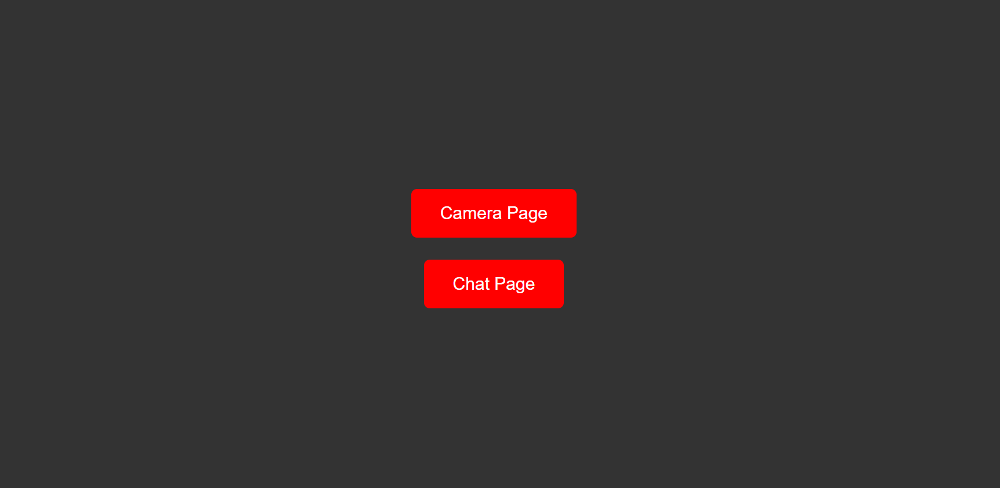
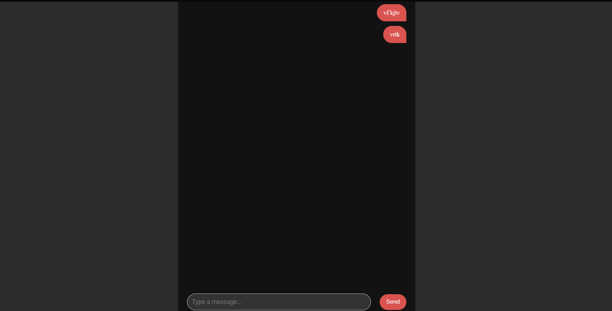
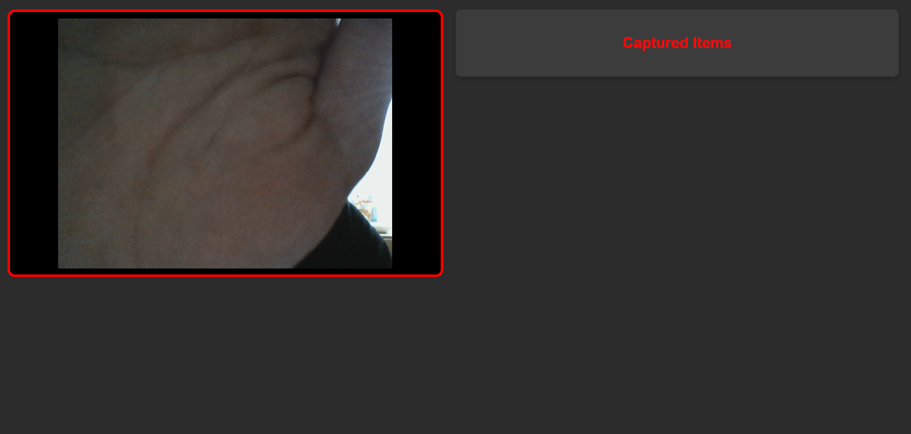

# Full Stack Application Setup Guide

This guide will walk you through the process of setting up a server (back-end) and an Angular application (front-end), including running unit tests. It assumes that you have Docker, Node.js, and Anaconda installed on your machine. 

## Prerequisites

Before starting, ensure that you have the following installed:

### 1. Docker
Docker is used for containerization, allowing you to easily manage dependencies and run services like Qdrant.

- [Install Docker](https://docs.docker.com/get-docker/) for your operating system.

### 2. Node.js and npm
Node.js is required for running the Angular app, and npm is the package manager.

- [Install Node.js](https://nodejs.org/) (preferably LTS version).

### 3. Anaconda
Anaconda is used to manage Python environments and dependencies for the back-end server.

- [Install Anaconda](https://www.anaconda.com/products/individual).

---

## Step 1: Set Up the Backend (Server)

### 1.1 Create a Python Environment
1. Open a terminal or Anaconda Prompt.
2. Create a new environment for the project:
    ```bash
    conda create --name myenv python=3.9
    ```
    Replace `myenv` with a name of your choice.
    
3. Activate the environment:
    ```bash
    conda activate myenv
    ```

### 1.2 Install Backend Dependencies
1. Navigate to the back-end folder where `requirements.txt` is located.
    ```bash
    cd Back-End
    ```

2. Install the required dependencies from `requirements.txt`:
    ```bash
    pip install -r requirements.txt
    ```

### 1.3 Run Qdrant Docker Container
1. Pull the Qdrant Docker image:
    ```bash
    docker pull qdrant/qdrant
    ```

2. Run the Qdrant server with the following command:
    ```bash
    docker run -p 6333:6333 qdrant/qdrant
    ```
    This will start the Qdrant server and expose it on port `6333`.

### 1.4 Start the Backend Server
1. In the back-end folder, run the server with the following command:
    ```bash
    python server_main.py
    ```

    The server will now be running, and you can access the back-end API on `http://localhost:5000` (default Flask server URL).

### 1.5 Running Unit Tests
To ensure that your server code is working correctly, you can run the unit tests.

1. Make sure you are in the back-end folder.
2. Run the following command to execute the unit tests:
    ```bash
    pytest test_app.py
    ```

---

## Step 2: Set Up the Frontend (Angular App)

### 2.1 Install Angular CLI
If you don't have Angular CLI installed yet, you can install it globally using npm.

```bash
npm install -g @angular/cli
```
2.2 Set Up the Front-End Application
Navigate to the front-end folder:

```bash
cd Front-End
```

2.3 Run the Angular Application
To run the Angular application, use the following command:

```bash
ng serve
```
This will start the Angular app and make it accessible at http://localhost:4200.

# Screenshots

## Main Menu


## Chat Page


Here you can interact with an inteligent agent to find out more about the site and how to control the drone using the camera page.

## Camera Page


Here you can interact with the camera and show diffrent signs that control the drone.
